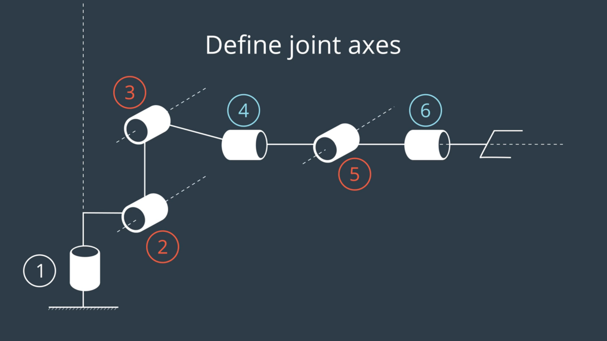

## Writeup

A statement and supporting figures explaining every step.

## Kinematic Analysis
* Run forward_kinematics demo and evaluate kr210.urdf.xacro
* DH Parameter Table with proper notations and description
* Annotated figure ofthe robot

### analysis
1. Unlabeled Diagram

2. Label all joints

3. Label all links

4. Draw lines through all joints, defining the joint axes.

## Project Implementation

## Bonus Points